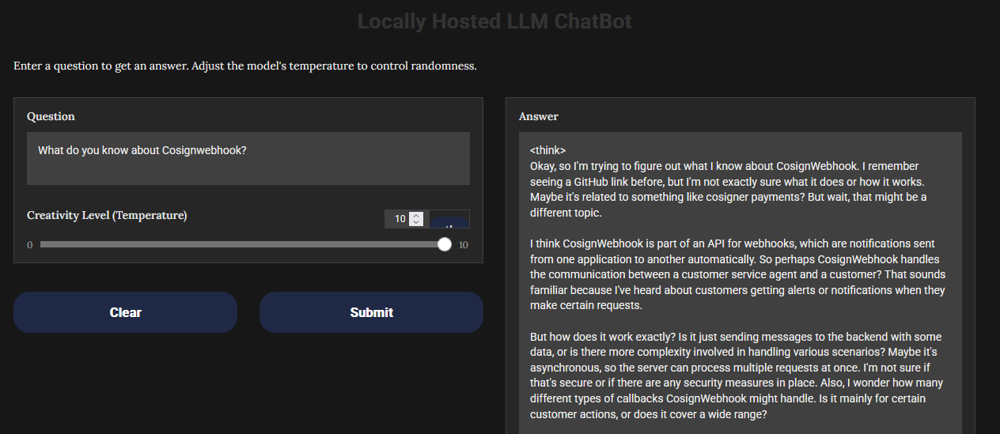

# Ollama Chatbot

A chatbot to use a local AI model like `deepseek-r1` to serve a web ui similar to ChatGPT, but locally, autark.

Data are scraped by a web crawler with pre-defined url.



## Preconditions

* Used with Ubuntu 22.04 VM
* Python3 with Python Pip

```bash
apt install -y python-pip
```

* Ollama

Ollama can be installed with

```bash
snap install ollama
```

Pull the required models

```bash
ollama pull nomic-embed-text
ollama pull deepseek-r1:1.5b
```

Should be look like something like this:

```bash
# ollama list
NAME                       ID              SIZE      MODIFIED
nomic-embed-text:latest    0a109f422b47    274 MB    3 hours ago
deepseek-r1:1.5b           a42b25d8c10a    1.1 GB    8 hours ago
```

[Deepseek-r1](https://ollama.com/library/deepseek-r1) are available in different flavors, depending on your used hardware.
See [Ollama Webpage](https://ollama.com/) for details and questions to install on other platforms.

Install Python Modules

```bash
python -m venv ./venv
. ./venv/bin/activate
./venv/bin/pip install -r requirements.txt
```

Python Venv can be deactivated with

```bash
deactivate
```

## Crawl data

Adjust `urls.txt` with your interested targets and start the crawler

```bash
./venv/bin/pypthon web_crawler.py
```

## Chatbot

Start the [Gradio Web UI](https://www.gradio.app):

```bash
./venv/bin/pypthon web_ui.py
```

Browse to http://127.0.0.1:9000 to use the Chatbot. In `config.txt` you can adjust listen address, port and used theme.

## Kubernetes

Run ollama-chatbot in Kubernetes (1.30+)

```bash
kubectl apply -f configmap.yaml
kubectl apply -f service.yaml
kubectl apply -f statefulset.yaml
```

Service is reachable via port-forward or on the service endpoint. Here is an example if you have cert-manager and ingress-nginx-controller installed:

```bash
kubectl apply -f issuer.yaml
kubectl apply -f ingress.yaml
```

Adjust hostname and e-mail address before usage.


## Use Case local data

An example to fetch local data can be a webserver in the same namespace of a Kubernetes cluster. Look at `kubernetes/gitrepo.yaml` as example. 
You can use as urls.txt in the ConfigMap

```
http://gitrepo.default/repo/
```

```bash
kubectl apply -f gitrepo.yaml
```

## Models

Tested models

| Model                             | Experience                                                                                               |
|-----------------------------------|----------------------------------------------------------------------------------------------------------|
| deepseek-r1:7b                    | good conversation , but long thinking time                                                               |   
| deepseek-r1:14b                   | the same                                                                                                 |
| llama3.1:8b                       | fast                                                                                                     |
| phi4:14b                          | needs >12GB                                                                                              |
| mistral:7b                        | few results                                                                                              |
| qwen:7b                           | server died
| codellama:7b                      | good result in short time on the second query, example output of the question, how Cosignwebhook works:  `The program is a Go application that uses Cosign to sign and verify Docker images. The program consists of three main components: the Dockerfile, the cosignwebhook.go file, and the main.go file. The Dockerfile is used to build the image, and it specifies the steps needed to build the image. It also includes a reference to the Cosign CLI tool, which will be used to sign the image when it is built. The cosignwebhook.go file is a webhook that listens for events from the Docker daemon and uses Cosign to verify the signature of the images that re being pulled or pushed. This ensures that only trusted images are being used in the system. The main.go file is the entry point of the program, and it sets up the webhook and starts it running. It also includes code to handle events from the Docker daemon, such as when an image is pulled or pushed.` |
| codellama:70b/deepseek-r1:70b/llama3.3:70b  | on GPU 128GB Ram, each model one by one ~42GB. Loaded >5 min no response

But this was only the first shot. Look at the [test folder](./tests/README.md) for a second and a deeper look.

## Ollama API

Ollama can be query directly via API. If you installed Ollama in Kubernetes with the provided manifests in the kubernetes folder, Ollama listen on all network interfaces and can be query on Kubernetes service endpoint.

```bash
# curl http://ollama.ollama-chatbot.svc.cluster.local:11434/api/chat -d '{
  "model": "deepseek-r1:7b",
  "messages": [
    { "role": "user", "content": "What is Cosignwebhook?" }
  ],
  "stream": false
}'
```

Within the provided Ingress manifest the Ollama API can be used from extern, e.g. `curl https://kubeadm.otc.mcsps.de/api`.

But be careful while exposing Ollama API: Everyone can use the API without authentification. Please refer [https://github.com/ollama/ollama/blob/main/docs/api.md](https://github.com/ollama/ollama/blob/main/docs/api.md)

## Credits

Inspired by [https://github.com/siddiqitaha/AI_Rag_Llama2](https://github.com/siddiqitaha/AI_Rag_Llama2)
