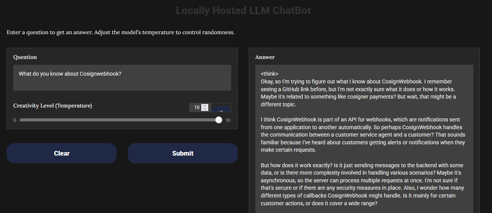

# Ollama Chatbot

A chatbot to use a local AI model like `deepseek-r1` to serve a web ui similar to ChatGPT, but locally, autark.

Data are scraped by a web crawler with pre-defined url.



## Preconditions

* Used with Ubuntu 22.04 VM
* Python3 with Python Pip

```bash
apt install -y python-pip
```

* Ollama

Ollama can be installed with

```bash
snap install ollama
```

Pull the required models

```bash
ollama pull nomic-embed-text
ollama pull deepseek-r1:1.5b
```

Should be look like something like this:

```bash
# ollama list
NAME                       ID              SIZE      MODIFIED
nomic-embed-text:latest    0a109f422b47    274 MB    3 hours ago
deepseek-r1:1.5b           a42b25d8c10a    1.1 GB    8 hours ago
```

[Deepseek-r1](https://ollama.com/library/deepseek-r1) are available in different flavors, depending on your used hardware.
See [Ollama Webpage](https://ollama.com/) for details and questions to install on other platforms.

Install Python Modules

```bash
python -m venv ./venv
. ./venv/bin/activate
./venv/bin/pip install -r requirements.txt
```

Python Venv can be deactivated with

```bash
deactivate
```

## Crawl data

Adjust `urls.txt` with your interested targets and start the crawler

```bash
./venv/bin/pypthon web_crawler.py
```

## Chatbot

Start the [Gradio Web UI](https://www.gradio.app):

```bash
./venv/bin/pypthon web_ui.py
```

Browse to http://127.0.0.1:9000 to use the Chatbot. In `config.txt` you can adjust listen address, port and used theme.

## Kubernetes

Run ollama-chatbot in Kubernetes (1.30+)

```bash
kubectl apply -f configmap.yaml
kubectl apply -f service.yaml
kubectl apply -f statefulset.yaml
```

Service is reachable via port-forward or on the service endpoint. Here is an example if you have cert-manager and ingress-nginx-controller installed:

```bash
kubectl apply -f issuer.yaml
kubectl apply -f ingress.yaml
```

Adjust hostname and e-mail address before usage.


## Credits

Inspired by [https://github.com/siddiqitaha/AI_Rag_Llama2](https://github.com/siddiqitaha/AI_Rag_Llama2)
